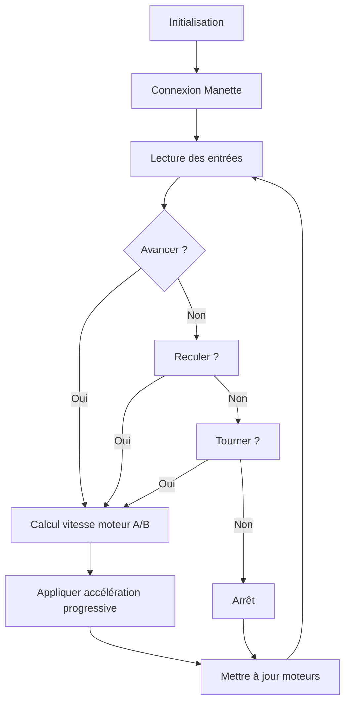

# 🚗 **YFighter-Car : Le Retour !**

*Un projet IoT de voiture RC contrôlée par manette Bluetooth avec ESP32*

---

## 📌 **Introduction au Projet**

### **Qu’est-ce que fait le projet ?**

**YFighter-Car** est une voiture télécommandée (RC) conçue pour des compétitions de vitesse ou de maniabilité. Elle est contrôlée via une **manette Bluetooth** (ou Wi-Fi) et intègre :

- Un **système de propulsion à 2 roues motrices arrière** (avec billes folles à l'avant).
- Deux **écrans OLED de 0,91 pouces** pour des animations personnalisées (yeux, effets lumineux).
- Un **contrôle précis** via des gâchettes (avancer/reculer) et un joystick (direction).
- Une **accélération progressive** pour éviter les pics de courant et protéger l'électronique.

### **Origine du projet**

Ce projet s’inscrit dans le cadre d’un **projet IoT** réalisé à **Montpellier YNOV Campus**, supervisé par **Anthony Orquin**.  
Il répond à la problématique suivante :

> *"Comment concevoir un véhicule RC performant, contrôlable à distance, avec des fonctionnalités ludiques et une gestion optimisée de l’énergie ?"*

### **Avantages/Inconvénients par rapport à d’autres projets**


| **Avantages** ✅                                                     | **Inconvénients** ❌                                                 |
| ------------------------------------------------------------------- | ------------------------------------------------------------------- |
| ✔ Contrôle intuitif via manette Bluetooth (gâchettes + joystick).   | ❌ Complexité initiale pour la gestion des pics de courant.          |
| ✔ Accélération progressive pour protéger le régulateur de tension.  | ❌ Autonomie limitée par la batterie LiPo 3S.                        |
| ✔ Matrice LED pour un côté esthétique et interactif.                | ❌ Nécessite un châssis imprimé en 3D (coût et temps).               |
| ✔ Code modulaire et bien documenté.                                 | ❌ Sensibilité aux interférences Bluetooth en environnement bruyant. |
| ✔ Design pensé pour les épreuves de la compétition.                 | ❌ Poids légèrement élevé dû aux composants électroniques.           |


### **Profils ayant travaillé sur le projet**

- **Théau Yapi** : Chef de projet, développement logiciel (C++/MicroPython), intégration matérielle.
-**Yuri Douguet**: développement logiciel (C++/MicroPython), intégration matérielle, conception 3D.
- **Superviseur** : Anthony Orquin (Montpellier YNOV Campus).

---

---

## 🔧 **Description du Projet**

### **Fonctionnalités Techniques**


| **Fonctionnalité**              | **Description**                                                                     |
| ------------------------------- | ----------------------------------------------------------------------------------- |
| **Contrôle Bluetooth**          | Utilisation d’une manette avec gâchettes (avancer/reculer) et joystick (direction). |
| **Accélération progressive**    | Évite les changements brutaux de vitesse pour protéger le régulateur.               |
| **écran OLED**                  | Animations personnalisées (yeux).                                                   |
| **Gestion des pics de courant** | Délais et condensateurs pour éviter de griller le régulateur.                       |


### **Spécifications Générales**


| **Critère**             | **Valeur**                                                         |
| ----------------------- | ------------------------------------------------------------------ |
| **Dimensions**          | 15x15x15 cm (max)                                                  |
| **Poids**               | ~500-700 g (selon batterie)                                        |
| **Vitesse maximale**    | ~10-15 km/h (selon réglages)                                       |
| **Autonomie**           | ~30-45 min (batterie LiPo 3S 2200mAh)                              |
| **Charges déplaçables** | Jusqu’à 200 g (selon adhérence des roues)                          |
| **Alimentation**        | Batterie LiPo 3S (11.1V) + Buck Converter (9V) + Régulateur 5V. |


### **Outils Utilisés**


| **Outil**             | **Utilisation**                                       |
| --------------------- | ----------------------------------------------------- |
| **Arduino IDE**       | Développement du code en C++.                         |
| **Bluepad32**         | Bibliothèque pour la gestion de la manette Bluetooth. |
| **Thonny**            | Tests initiaux avec MicroPython.                      |


---

---

## 🎮 **Aperçu du Fonctionnement et Manuel d’Utilisation**

### **Comment utiliser le projet ?**

1. **Branchement** :
  - installer la batterie au centre de l'appareilet l'attacher avec les sangles.
  - connecter la batterie à l'interrupteur (prise XT60).
  - Connecter les moteurs et les écrans OLED selon le **schéma de câblage** (voir section dédiée).
2. **Allumage** :
  - Activer l’interrupteur principal.
  - L’ESP32 démarre et attend qu'une manette se connecte.
3. **Connexion de la manette** :
  - Appuyer sur le bouton de connexion de la manette (ex : bouton "Home" puis bouton de synchronisation sur une manette Xbox).
  - La manette arrete de clignoter et la led de la manette reste fixe : la manette est connecté.
4. **Contrôle** :
  - **Gâchette droite (RT)** : Avancer (vitesse proportionnelle à l’enfoncement).
  - **Gâchette gauche (LT)** : Reculer (vitesse proportionnelle à l’enfoncement).
  - **Joystick gauche (axe X)** : Tourner à gauche/droite (différentiel sur les moteurs).
  - **Si les deux gâchettes sont enfoncées** : Priorité à la gâchette droite (avancer).
5. **Arrêt** :
  - Relâcher les gâchettes pour arrêter le véhicule.
  - Éteindre l’interrupteur principal pour couper l’alimentation.

### **Manuel d’Utilisation (Résumé)**


| **Action**           | **Commande**                    |
| -------------------- | ------------------------------- |
| **Avancer**          | Gâchette droite (RT) enfoncée.  |
| **Reculer**          | Gâchette gauche (LT) enfoncée.  |
| **Tourner à gauche** | Joystick gauche vers la gauche. |
| **Tourner à droite** | Joystick gauche vers la droite. |
| **Arrêt**            | Relâcher les gâchettes.         |


> ⚠️ **Attention** :
>
> - Éviter de bloquer les roues en forçant le moteur (risque de surchauffe).
> - Ne pas exposer le véhicule à l’eau ou à des chocs violents.

---

---

## 🔌 **Pinout et Schéma de Câblage**

### **Schéma de Câblage**


### **Explications des Signaux**


| **Composant**      | **Broche ESP32** | **Rôle**                    | **Pourquoi ?**                                   |
| ------------------ | ---------------- | --------------------------- | ------------------------------------------------ |
| **DRV8833 IN1**    | GPIO26           | Contrôle direction Moteur A | Permet d’inverser le sens de rotation.           |
| **DRV8833 IN2**    | GPIO25           | Contrôle direction Moteur A | Complémentaire à IN1.                            |
| **DRV8833 IN3**    | GPIO33           | Contrôle direction Moteur B | Permet d’inverser le sens de rotation.           |
| **DRV8833 IN4**    | GPIO32           | Contrôle direction Moteur B | Complémentaire à IN3.                            |
| **Matrice LED**    | GPIO22           | Données (DIN)               | Transmet les signaux pour les animations.        |
| **OLED SDA**       | GPIO21           | I2C Data                    | Communication avec l’écran.                      |
| **OLED SCL**       | GPIO22           | I2C Clock                   | Synchronisation I2C.                             |
| **Buck Converter** | 5V               | Alimentation                | Convertit 11.1V (LiPo) en 9V pour le DRV8833. |
| **Régulateur 5V**  | 5V               | Alimentation                | Alimente l’ESP32 et les écrans OLED.              |


> 📌 **Remarque** :
>
> - Les moteurs sont branchés sur les sorties **OUT1/OUT2** (Moteur A) et **OUT3/OUT4** (Moteur B) du DRV8833.
> - La batterie LiPo 3S est connectée au **Buck Converter** (entrée 11.1V, sortie 9V).

---

---

## ⚡ **Caractéristiques Électriques**

### **Bilan Énergétique**
**Capacité de la batterie** : **27,7Wh**.
#### bilan énergétique moyen


#### bilan énergétique maximal


### **Choix de la Batterie**

- **Pourquoi une LiPo 3S 2200mAh ?**
  - **Tension** : 11.1V pour alimenter le DRV8833 (9V après Buck Converter).
  - **Capacité** : 2500mAh pour un bon compromis poids/autonomie.
  - **Poids** : ~150-200 g (acceptable pour un véhicule de 15x15 cm).

> ⚠️ **Précautions** :
>
> - Utiliser un **chargeur dédié LiPo** pour éviter les risques d’incendie.
> - Ne pas décharger en dessous de **3.0V par cellule** (9V total).

---

---

## 💻 **Programmation**

### **Algorithme Global (Haut Niveau)**



### **Code Principal (C++)**

#### **Logique de Contrôle**

- **Gâchettes** : `brake()` (droite) et `throttle()` (gauche) pour avancer/reculer.
- **Joystick** : `axisX()` pour tourner (différentiel).
- **Accélération progressive** : Incréments de ±10 toutes les 20 ms.

#### **Extrait du Code**

```cpp
// Logique de contrôle avec gâchettes et joystick
void processGamepad(ControllerPtr ctl) {
    int rightTrigger = ctl->brake();    // Gâchette droite (0-255)
    int leftTrigger = ctl->throttle();  // Gâchette gauche (0-255)
    int leftX = ctl->axisX();            // Joystick gauche (-511 à 511)

    // Deadzone
    if (abs(leftX) < 10) leftX = 0;
    if (rightTrigger < 10) rightTrigger = 0;
    if (leftTrigger < 10) leftTrigger = 0;

    // Vitesse de base (avancer/reculer)
    int baseSpeed = 0;
    if (rightTrigger > 0 && leftTrigger == 0) {
        baseSpeed = map(rightTrigger, 0, 255, 0, 255);
    } else if (leftTrigger > 0 && rightTrigger == 0) {
        baseSpeed = -map(leftTrigger, 0, 255, 0, 255);
    } else if (rightTrigger > 0 && leftTrigger > 0) {
        baseSpeed = map(rightTrigger, 0, 255, 0, 255); // Priorité à avancer
    }

    // Vitesse différentielle pour tourner
    targetMotorASpeed = baseSpeed - leftX;
    targetMotorBSpeed = baseSpeed + leftX;

    // Limiter les vitesses
    targetMotorASpeed = constrain(targetMotorASpeed, -255, 255);
    targetMotorBSpeed = constrain(targetMotorBSpeed, -255, 255);
}
```

#### **Explications du Code**

- `**brake()` et `throttle()**` : Méthodes de Bluepad32 pour lire les gâchettes.
- `**axisX()**` : Méthode pour lire l’axe horizontal du joystick gauche.
- **Accélération progressive** : Évite les à-coups en ajustant la vitesse par paliers.
- **Gestion des conflits** : Priorité à la gâchette droite si les deux sont enfoncées.

---

---

## 🛠️ **Implémentation**

### **Montage Électronique**

1. **Châssis** :
  - Imprimé en 3D avec emplacements pour les moteurs, la batterie, et l’électronique.
2. **Câblage** :
  - Utilisation de **fils de 22 AWG** pour les connexions.
  - **Condensateurs de découplage** (100 µF) près des moteurs pour absorber les pics de courant.
3. **Fixation** :
  - Moteurs fixés avec des **vis M3**.
  - Batterie maintenue par des **sangles ou un support 3D**.

### **Implémentation du Code**

1. **Bibliothèques utilisées** :
  - **Bluepad32** : Gestion de la manette Bluetooth.
  - **Adafruit_GFX** et **Adafruit_SSD1306** : Affichage OLED.
  - **Wire** : Communication I2C.
2. **Fonctionnalités clés** :
  - **Contrôle différentiel** : Tourner en faisant varier la vitesse des moteurs.
  - **Accélération progressive** : Évite les pics de courant.
  - **Affichage OLED** : Retour visuel des vitesses des moteurs.
3. **Tests et Validation** :
  - Vérification du sens des moteurs (inversion si nécessaire).
  - Test de l’autonomie et de la stabilité du véhicule.

---

---

## 🎯 **Conclusion**

### **Bilan des Résultats**


| **Critère**        | **Résultat** | **Commentaire**                                         |
| ------------------ | ------------ | ------------------------------------------------------- |
| **Fonctionnalité** | ✅ OK         | Contrôle fluide, réactif, et intuitif.                  |
| **Autonomie**      | ✅ OK         | ~1h et plusieurs batteries de rechange.  |
| **Stabilité**      | ✅ OK         | Bonne adhérence grâce aux roues en silicone.            |
| **Robustesse**     | ✅ OK         | Châssis solide, mais sensible aux chocs violents.       |


### **Améliorations Possibles**

1. **Autonomie** :
  - Optimiser le code pour réduire la consommation (ex : désactiver le Bluetooth en veille).
2. **Contrôle** :
  - Ajouter un **mode "turbo"** (vitesse maximale sans accélération progressive).
3. **Matériel** :
  - Remplacer le DRV8833 par un **L298N** pour une meilleure gestion des courants élevés.
  - Ajouter un **capteur de température** pour surveiller la surchauffe.
  - Remplacer les moteurs actuels par des **moteurs brushless** pour plus de puissance.

### **Réussites**

✅ **Contrôle intuitif** grâce aux gâchettes et au joystick.  
✅ **Accélération progressive** pour protéger l’électronique.  
✅ **Design esthétique** avec la matrice LED et le châssis inspiré d’un animal.  
✅ **Documentation complète** (schémas, code commenté, README).

### **Échecs/Difficultés**

❌ **Problèmes initiaux avec le Bluetooth BLE** → Résolu en utilisant le **Bluetooth Série (SPP)**.  
❌ **Surchauffe du régulateur** → Résolu avec des **condensateurs de découplage** et une accélération progressive.  
❌ **Sensibilité aux interférences** → À améliorer avec un blindage des câbles.

### **Ressenti Personnel**

> *"Ce projet a été une excellente opportunité pour appliquer mes connaissances en IoT et en programmation embarquée. J’ai particulièrement apprécié la phase de prototypage et les défis techniques rencontrés (comme la gestion des pics de courant). Le résultat final est un véhicule fonctionnel, ludique, et personnalisable, même s’il reste des axes d’amélioration pour les futures versions !"*

---

### **📌 Liens Utiles**

- **Documentation Bluepad32** : [https://github.com/ricardoquesada/bluepad32](https://github.com/ricardoquesada/bluepad32).

---

---

**📜 Licence** : Ce projet est sous licence **MIT** (libre utilisation, modification et distribution).  
**📧 Contact** : [[theau.yapi@ynov.com](mailto:theau.yapi@ynov.com)] | [LinkedIn](https://www.linkedin.com/in/theau-yapi)